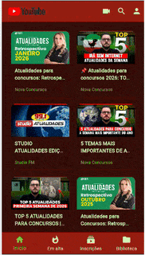

# 📺 YouTube Clone - Projeto Final

[](https://flutter.dev/)
[](https://dart.dev/)
[](https://developers.google.com/youtube/v3)

Este repositório contém o projeto final do módulo de Flutter, onde desenvolvi um clone funcional da interface do YouTube. O app consome dados reais via **YouTube Data API v3** e implementa funcionalidades complexas de navegação, busca e layouts adaptáveis.

## 🎥 Demonstração

No GIF abaixo, é possível observar a navegação entre as abas, a funcionalidade de busca dinâmica e a fluidez do layout em Grid e Lista:

<p align="center">
  
</p>

---

## 🚀 Funcionalidades Implementadas

* **Página de Início:** Grid responsivo com vídeos variados carregados via Search API.
* **Em Alta (Trending):** Lista vertical com os vídeos mais populares do momento.
* **Inscrições (Subscriptions):** Feed com trilho horizontal de canais e cards dinâmicos.
* **Biblioteca (Library):** Organização de histórico e playlists com layouts horizontais.
* **Busca em Tempo Real:** Barra de pesquisa funcional integrada usando `SearchDelegate`.
* **Player de Vídeo:** Integração com navegação via `GoRouter` para visualização de detalhes.

---

## 🛠️ Desafios Técnicos & Soluções

Durante o desenvolvimento, enfrentei e resolvi desafios cruciais de engenharia de software:

* **Híbrido de Grid e List:** O componente `VideoCard` foi projetado para funcionar dentro de `GridView` e `ListView`. A solução envolveu o uso estratégico de `SizedBox` e `Expanded` para gerenciar restrições de altura conforme o contexto.
* **Persistência de Estado na Busca:** Implementação de lógica no `BottomNavigationBar` para resetar o termo de pesquisa ao retornar à Home, garantindo uma UX intuitiva e consistente.
* **Gerenciamento de Constraints:** Resolução de erros de overflow em dispositivos reais através do ajuste refinado de `childAspectRatio` e hierarquia de widgets flexíveis.

---

## 🎨 Identidade Visual (Design System)

O app utiliza um tema escuro personalizado com a seguinte paleta de cores:
* **Deep Wine:** Fundo principal dos cards e elementos de destaque.
* **Fire Red:** Sombras de elevação e indicadores de progresso.
* **Soft Lime & Electric Green:** Tipografia contrastante para títulos e nomes de canais.

---

## ⚙️ Como executar o projeto

1. Clone este repositório.
2. Obtenha sua chave da API no [Google Cloud Console](https://console.cloud.google.com/).
3. Insira sua chave no arquivo de serviço correspondente (`youtube_service.dart`).
4. Execute os comandos abaixo no terminal:
   ```bash
   flutter pub get
   flutter run

### 🔑 Configuração da API

Para rodar este projeto, você precisará de uma API Key do Google Cloud:

1. Obtenha uma chave em [Google Cloud Console](https://console.cloud.google.com/).
2. Ative a **YouTube Data API v3**.
3. Na raiz do projeto, duplique o arquivo `.env.example` e renomeie para `.env`.
4. Cole sua chave na variável `YOUTUBE_API_KEY`.